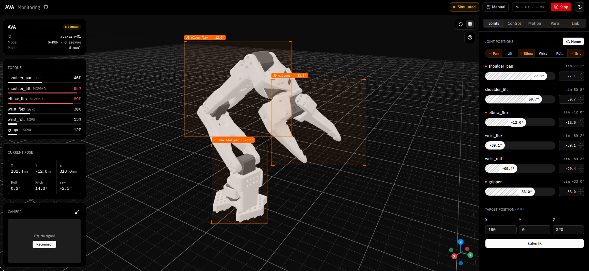

<h1 align="center">◈ &nbsp;A V A &nbsp;◈</h1>

<hr>

<p align="center"><b>web dashboard for a 6-DOF desk arm · live 3D view · ROS 2 over rosbridge</b></p>

<p align="center"><a href="https://github.com/TomasSirotek/ava-arm"></a>&nbsp;&nbsp;&nbsp;</p>

<p align="center"></p>

<p align="center"><sub><i>Screenshot of the work-in-progress dashboard — UI still evolving.</i></sub></p>

A static Vite + React SPA that talks to ROS 2 over rosbridge (WebSocket), so it
needs no server of its own.

> Status: shows and drives the robot live over rosbridge (Gazebo today, hardware
> later). Without ROS it falls back to a built-in simulation. Still placeholders:
> Current pose card, Solve IK, camera, voice. See [CHANGELOG.md](CHANGELOG.md).

## Features

**Header**: connection status — 🟢 Connected (live `/joint_states`), 🟠 No joint data
(rosbridge up, no robot), 🟠 Simulated (no rosbridge) — current control mode,
link rate and latency, emergency **Stop / Release**, and a light / dark / system
theme toggle.

**3D viewport**: the robot's real URDF (`public/robot/urdf/ava.urdf`, see
[Run](#run)) posed from the joint state, with orbit controls, a reset-camera button,
a grid toggle, a help popover, and an X/Y/Z axis gizmo in the ROS frame (click an
axis to look along it). Joints picked in the Joints tab are outlined with a
labelled box that tracks them on screen.

**Floating cards** over the viewport, sized to always fit its height:

- **Info**: robot ID, model, control mode, link stats, online / stopped badge
- **Torque**: effort per joint and servo type, red above 85 %
- **Current pose**: X / Y / Z and roll / pitch / yaw
- **Camera**: Kinect preview slot; click to expand, <kbd>Esc</kbd> to collapse

**Sidebar tabs**:

| Tab | What it does |
| --- | --- |
| Joints | Slider and number box per joint (ranges = URDF limits), Home, joint highlight pills, Cartesian target + Solve IK (placeholder) |
| Control | Manual / Automatic (demos: Wave, Pick & place, Joint sweep, Home & park; voice mocked) / Controller (browser Gamepad API) |
| Motion | Velocity scale and trajectory duration (set how fast slider moves and demos run); acceleration and Simulation/Hardware are not applied yet |
| Parts | Hardware list filterable by Servos / Controller / Sensors: photo, live V / A / °C, load and a folding datasheet |
| Link | rosbridge WebSocket URL and Connect |

The joint sliders lock while the e-stop is engaged, in Automatic mode, or in
Controller mode once a pad is connected. Every action confirms itself with a
toast (sonner, colour-coded: success, info, warning, error).

## Architecture

- **Feature folders.** Code is grouped by feature under `src/features/`, not by
  file type. Everything for one feature sits flat in its folder.
- **State in zustand stores.** Shared state lives in small stores (`*.store.ts`):
  robot telemetry, control mode and e-stop, highlighted joints. Components
  subscribe to single values with selectors, so a telemetry tick only re-renders
  the numbers that changed. Purely local UI state stays in `useState`.
- **Background feeds as hooks.** `app.providers.tsx` runs the hooks that fill the
  stores (the rosbridge feed, the command sender, the demo runner, the gamepad
  watcher) and the theme context.
- **One command path.** Sliders and demos set `commanded` in the robot store.
  With rosbridge it is sent to `/joint_trajectory_controller/joint_trajectory`;
  without it the built-in simulation eases toward it (`robot.store.ts`).
- **Layout separate from content.** `layout/app-layout.tsx` is only the page
  shell (header / viewport / sidebar slots and the toaster). `app/app.tsx` fills
  the slots.
- **Lazy 3D.** three.js loads as its own chunk, so the controls render first.
- **React 19 idioms**: `<Context value>` and `use()`, ref as a prop (no
  `forwardRef`). The one class component is the model's error boundary, which
  React still has no hook for.

## Project structure

```
src/
  main.tsx                  mounts <App />
  index.css                 Tailwind v4 theme tokens (Asap / Geist Mono)
  app/                      app root and providers
  layout/                   page shell
  components/
    ui/                     shadcn/ui components (generated, not hand-edited)
    shared/                 Heading, Field, Setting, shared styles
  lib/utils.ts              cn(), firstValue()
  features/
    header/                 header bar: status, link stats, e-stop, GitHub link
    navigation/             sidebar tabs
    joints/                 joint sliders, highlight pills
    target/                 Cartesian target + IK
    control/                control modes, voice settings, gamepad
    motion/                 sim / hardware target, limits
    parts/                  hardware parts catalogue
    connection/             rosbridge URL
    overlay/                floating cards over the viewport
    viewport/               three.js canvas, model, joint tracker, toolbar
    robot/                  robot store, rosbridge feed, command sender
    demos/                  automatic-mode demos and their runner
    theme/                  theme provider and toggle
```

### File naming

Inside a feature folder every file is named after what it holds:

| File | Holds |
| --- | --- |
| `thing.tsx` | a component (kebab-case, one per file) |
| `thing.interface.ts` | types and interfaces, prefixed `I` (`IPart`, `IJointRowProps`) |
| `thing.content.ts(x)` | static data and config: labels, defaults, lists, `useNavItems()` |
| `thing.store.ts` | zustand store and selectors |
| `use-thing.ts` | a hook |
| `thing.context.ts` | a React context |

Imports always use the `@/` alias (`@/features/parts/parts.content`), never
relative `./` or `../` paths.

## Clone

Standalone:

```bash
git clone git@github.com:TomasSirotek/ava-dashboard.git
cd ava-dashboard
```

Or as part of ava-arm, where it lives at `dashboard/`:

```bash
git clone --recurse-submodules git@github.com:TomasSirotek/ava-arm.git
cd ava-arm/dashboard
```

## Run

Requires Node 22.12+ and pnpm.

```bash
pnpm install
pnpm dev        # dev server at http://localhost:5173
```

The robot model comes from the ROS repo through a symlink (git-ignored), so the
URDF and meshes have one source of truth. Inside ava-arm:

```bash
ln -s ../../ros2_ws/src/ava_description public/robot
```

For live data, run rosbridge (`ros2 launch rosbridge_server rosbridge_websocket_launch.xml`,
default `ws://localhost:9090`; override with `VITE_ROSBRIDGE_URL`). See the
[ava-arm README](https://github.com/TomasSirotek/ava-arm#run).

## Scripts

| Script | Does |
| --- | --- |
| `pnpm dev` | dev server |
| `pnpm build` | static output in `dist/` |
| `pnpm preview` | serve the built `dist/` |
| `pnpm typecheck` | TypeScript check |
| `pnpm check` | Biome: lint + format + import order, no changes |
| `pnpm check:fix` | Biome: apply safe fixes and formatting |
| `pnpm lint` | Biome lint only |
| `pnpm format` | Biome format only |

Biome config is in `biome.json`: double quotes, no semicolons, 2-space indent,
140-column lines.

`dist/` works from any static file server, e.g. on a Raspberry Pi:

```bash
cd dist && python3 -m http.server 8080
```

## Stack

Vite, React 19, TypeScript, Tailwind CSS v4, shadcn/ui (Base UI), three.js /
react-three-fiber / drei, zustand, sonner, lucide-react, roslib, urdf-loader, Biome.
